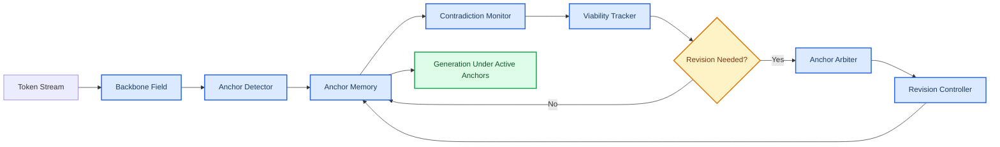

# V1 Implementation Spec — Anchor-Centric ABPT

Date: 2026-03-27
Status: active pre-code implementation spec
Related:
- `docs/research/2026-03-26-anchor-framework.md`
- `docs/research/2026-03-26-anchor-objects.md`
- `docs/research/2026-03-26-architecture-requirements.md`
- `docs/research/2026-03-27-next-architecture-sketch.md`
- `docs/research/PROJECT_MAP.md`

## 1. Purpose

This document defines the **minimal first implementation** of the next anchor-centric model.
It is intentionally narrower than the architecture sketch.
The goal is not to solve the whole theory in one pass, but to build the smallest system that can meaningfully test the core claim.

Core question:

> Can a model that explicitly detects, stores, stresses, and revises anchors behave differently from a plain flow-only transformer in places where false anchors should lead to dead ends?

## 2. V1 design principle

V1 should implement only the subsystems required to test four claims:
- anchors can be detected as runtime objects
- anchors can be stored with explicit state
- contradiction pressure can accumulate before final collapse
- false anchors can be revised instead of being blindly carried forward

Everything else stays secondary.

## 3. V1 scope

### Included in v1
- transformer backbone
- optional AttnRes
- anchor detector
- anchor memory
- contradiction monitor
- viability tracker
- revision controller
- minimal anchor arbiter
- minimal logging / metrics for anchor events

### Explicitly excluded from v1
- full descendant graph construction
- aggressive online plasticity
- complex multi-branch search everywhere
- Stage B ED/equilibrium routing revival
- heavy selective compute policy
- full DAG semantics

## 4. Subsystems in v1

### 4.1 Backbone field
Base model for token processing.

Responsibilities:
- produce contextual hidden states
- remain compatible with current training stack
- expose hidden states needed by anchor subsystems

V1 choice:
- keep existing transformer backbone
- keep AttnRes optional behind config

### 4.2 Anchor detector
First runtime objectizer.

Inputs:
- `h_t`
- short recent window `h_{t-w:t-1}`
- optional span prior score

Outputs:
- anchor candidate score
- candidate boundary hypothesis
- candidate representation
- local semantic weight estimate

V1 simplification:
- candidate spans may initially be short windows or recently closed phrases
- no need for perfect span closure in v1

### 4.3 Anchor memory
Persistent state for active anchors.

Each anchor object in v1 should minimally store:
- `id`
- `start_idx`
- `end_idx`
- `repr`
- `score`
- `state`
- `support`
- `contradiction_pressure`
- `viability`
- `ttl`

V1 states:
- `candidate`
- `provisional`
- `confirmed`
- `decaying`
- `dead_end`

### 4.4 Contradiction monitor
Measures whether an anchor is becoming harder to defend.

Candidate inputs:
- verifier disagreement
- local branch divergence
- incompatible future signals
- repair-cost proxy
- retrospective mismatch proxy

V1 output:
- scalar `C(a,t)` per active anchor

V1 simplification:
- allow contradiction pressure to be heuristic and imperfect
- what matters is that it is explicit, logged, and stateful

### 4.5 Viability tracker
Transforms support and contradiction into anchor health.

Inputs:
- anchor score
- support trajectory
- contradiction pressure
- age / ttl

Outputs:
- `V(a,t)`
- possible state transition

V1 function:
- distinguish "strong but failing" from "weak but harmless"
- provide a trigger for revision before collapse

### 4.6 Revision controller
Acts when viability drops far enough or contradiction rises high enough.

Possible actions in v1:
- downgrade anchor state
- reduce anchor influence weight
- trigger one alternative interpretation branch
- mark anchor as `dead_end`

V1 simplification:
- revision may be local and conservative
- one alternative is enough in the first version

### 4.7 Minimal anchor arbiter
Scores current anchor reading against one alternative.

Responsibilities:
- compare current vs alternative reading
- prefer the reading with lower contradiction and better short-future consistency

V1 simplification:
- no large branch set
- no global verifier redesign yet
- can be implemented as a compact scoring head or explicit comparison module

## 5. V1 data flow

## 6. Anchor object schema for v1

A practical v1 anchor object should look conceptually like this:

| Field | Meaning | Required in v1 |
|---|---|---|
| `id` | unique anchor identifier | yes |
| `start_idx`, `end_idx` | span hypothesis | yes |
| `repr` | anchor representation vector | yes |
| `score` | current anchor score | yes |
| `state` | lifecycle state | yes |
| `support` | accumulated confirming evidence | yes |
| `contradiction_pressure` | accumulated stress | yes |
| `viability` | current survival estimate | yes |
| `ttl` | remaining semantic lifetime estimate | yes |
| `parent_id` | ancestor anchor link | no |
| `descendant_mass` | coarse future burden | optional |
| `branch_id` | alternate reading identity | optional |

## 7. V1 state transitions

A simple first policy:

- `candidate -> provisional`
  - if score exceeds creation threshold
- `provisional -> confirmed`
  - if support persists and contradiction remains low
- `provisional -> dead_end`
  - if contradiction rises early and viability collapses
- `confirmed -> decaying`
  - if ttl is nearing expiry or influence weakens
- `confirmed -> dead_end`
  - if contradiction overwhelms support
- `decaying -> dead_end`
  - if the anchor is no longer worth defending

V1 should prefer **explicit transitions** over implicit disappearance.

## 8. Minimal algorithms to implement

### 8.1 Detector ansatz
Use the current working law:
- `A(a) = sigma(w1 * S_prior(a) + w2 * S_runtime(a))`

V1 acceptable proxies:
- `S_prior(a)` from simple phrase/n-gram prior or learned prior head
- `S_runtime(a)` from hidden-state transition magnitude or closure-sensitive detector

### 8.2 Viability ansatz
V1 can use a simple monotonic form such as:
- `V(a,t) = sigma(alpha * support - beta * contradiction_pressure - gamma * age_penalty)`

No need to freeze this as final theory.
It only needs to be inspectable and testable.

### 8.3 Revision trigger
A revision event occurs when one of these holds:
- `V(a,t) < tau_v`
- `C(a,t) > tau_c`
- arbiter prefers an alternative reading by margin `m`

## 9. Training and evaluation consequences

V1 should produce logs and outputs that a plain LM would not:
- anchor creation events
- anchor state transitions
- contradiction trajectories
- viability trajectories
- revision events
- dead-end recognitions

This means `forward()` should expose anchor diagnostics in structured form.

## 10. First experiments for v1

V1 is not validated by generic perplexity alone.
The first experiments should target:

### 10.1 Math toy cases
Use the research cases already documented in:
- `docs/research/2026-03-26-math-toy-cases.md`

Measure whether v1:
- detects the intended true anchor
- distinguishes plausible false anchor cases
- accumulates contradiction before full failure
- triggers revision earlier than a plain baseline would

### 10.2 Controlled false-anchor prompts
Construct prompts where:
- one reading is tempting but wrong
- a later continuation exposes the dead end

Measure:
- time-to-contradiction
- time-to-revision
- whether dead-end recognition happens before total collapse

### 10.3 Ablation checks
At minimum compare:
- backbone only
- backbone + detector + memory
- backbone + detector + memory + contradiction/viability
- full v1

## 11. Mapping from current repo to v1 work

| Current repo piece | V1 action |
|---|---|
| `src/model/backbone.py` | keep as base |
| `src/model/attention.py` | keep optional AttnRes |
| `src/model/branches.py` | reinterpret narrowly for alternative anchor reading |
| `src/model/verifier.py` | reinterpret into minimal arbiter logic |
| `src/model/plastic.py` | exclude from first strict v1 unless needed later |
| `src/model/abpt_b.py` | do not treat as v1 base |
| `src/model/equilibrium.py` | not central for v1 |
| `train.py` | later adapt to expose anchor diagnostics |

## 12. Implementation philosophy

V1 should optimize for:
- explicitness over elegance
- inspectability over cleverness
- local reversible logic over aggressive self-modification
- theory testability over benchmark theater

## 13. Exit criteria for v1

V1 is good enough when all of the following are true:
- anchors exist as explicit runtime objects
- anchor states change over time in logged form
- contradiction pressure can rise before final failure
- dead-end recognition exists as an explicit event
- at least one false-anchor math toy case shows meaningful revision behavior

## 14. One-sentence summary

V1 should be the smallest transformer-plus-anchor system that can explicitly create anchors, track their health, recognize when a false anchor is becoming untenable, and revise it before total trajectory collapse.
