# ABPT vNext — Anchor controller over FOG flow

Date: 2026-04-11  
Status: active direction memo

## Decision

We should **keep the anchor layer** and **replace the old Stage B equilibrium-routing center with a FOG-style heterogeneous flow layer**.

In short:

- **Anchor** stays as the object layer of reasoning.
- **FOG** becomes the preferred geometry layer of computation.
- **Stage B ED-routing** is demoted from architectural center to historical prototype.

---

## Why not FOG-only?

FOG explains a useful part of the problem:

- different functions want different subspace geometry,
- memory / compare / select / transform should not share one monolithic uniform bottleneck,
- structured depth and width can improve parameter efficiency.

But FOG alone does **not** define:

- what counts as an anchor,
- how anchors persist,
- how contradictions accumulate,
- how dead ends are detected,
- how revision is triggered.

That means FOG can improve the **substrate**, but it does not replace the **reasoning object model**.

---

## Why not old Stage B?

Recent verification showed:

- once Stage B routing is made real instead of staying in warmup,
- it does route tokens into branch / backward / plastic buckets,
- but the resulting model underperforms both baseline and anchor-centric variants.

So the problem is no longer "Stage B was buggy only".
The stronger conclusion is:

> **generic equilibrium-deviation routing is not a good conceptual center for this project.**

It may remain a weak auxiliary signal, but not the main control mechanism.

---

## Domain dependence: what it means here

The observed gap across domains is **not unique to our models**.
All transformers are domain-dependent because:

1. finite capacity must match the statistics of the training domain,
2. architectural bias helps when it matches the task structure,
3. natural text and synthetic symbolic templates reward different inductive biases.

So the right question is not:

> "Does only ABPT/FOG have domain dependence?"

The right question is:

> "Which inductive bias helps on which domain, and why?"

---

## Current interpretation of our results

### anchor-synthetic

Anchor-centric models win because the domain is built around:

- repeated symbolic regimes,
- explicit semantic flips,
- stable-vs-conflict trajectories,
- low template diversity,
- anchor-like failure modes.

This is exactly where explicit anchor state is useful.

### TinyStories

Baseline transformers remain strong because the domain rewards:

- smooth local continuation,
- broad lexical diversity,
- rich natural-language statistics,
- distributed soft cues rather than a few repeated symbolic templates.

This weakens the relative advantage of explicit anchor machinery.

### FOG

FOG remains promising because natural text still contains heterogeneous computational demands.
But those demands are softer and more distributed than in anchor-synthetic.

That implies:

- FOG can help as a **flow geometry** even on natural text,
- but the anchor layer must earn its cost through better controller logic, not by being bolted on everywhere.

---

## vNext split

```mermaid
flowchart LR
    accTitle: ABPT vNext
    accDescr: FOG-style flow layer with anchor-centric control layer above it.

    tokens["Tokens"] --> fog["FOG Flow Layer
heterogeneous compare / memory / transform motifs"]
    fog --> detector["Anchor Detector"]
    detector --> memory["Anchor Memory"]
    memory --> contradiction["Contradiction / Viability"]
    contradiction --> arbiter["Revision Arbiter"]
    arbiter --> output["Output under active anchors"]

    classDef flow fill:#dbeafe,stroke:#2563eb,stroke-width:2px,color:#1e3a5f
    classDef anchor fill:#ede9fe,stroke:#7c3aed,stroke-width:2px,color:#4c1d95
    class fog flow
    class detector,memory,contradiction,arbiter anchor
```

---

## Concrete architectural stance

### Keep

- transformer-compatible token flow,
- optional AttnRes where still useful,
- anchor detector / memory / contradiction / viability / revision stack,
- plasticity only as a bounded auxiliary mechanism.

### Replace

- old uniform flow layer with a **FOG-style heterogeneous motif stack**.

### Retire as center

- equilibrium deviation as master signal,
- ED bucket routing as the primary selective-compute framework.

---

## Near-term implementation order

1. **Build a FOG-backed flow option for anchor models**
   - keep external interface stable,
   - swap only the flow substrate first.

2. **Keep anchor controller narrow**
   - detector,
   - memory,
   - contradiction pressure,
   - viability,
   - revision arbiter.

3. **Delay aggressive selective routing**
   - no heavy backward token routing,
   - no Stage B-style bucket economy as center.

4. **Re-test on two domains**
   - anchor-synthetic,
   - TinyStories.

The goal is to see whether:

> **FOG improves the flow layer while anchor logic preserves the object-level advantage.**

---

## One-sentence conclusion

FOG is not enough to replace the anchor hypothesis, but it is strong enough to replace the old Stage B routing substrate; the next model should therefore be **Anchor over FOG**, not **Anchor over ED-routing** and not **FOG-only** by default.
