# Architecture V1 — ABPT

Date: 2026-03-27
Status: active canonical architecture memo
Sources:
- `docs/research/2026-03-26-architecture-requirements.md`
- `docs/research/2026-03-26-keep-rewrite-retire.md`
- `docs/research/2026-03-27-next-architecture-sketch.md`
- `docs/research/2026-03-27-v1-implementation-spec.md`

## 🎯 Purpose

This is the compact architecture document for the first anchor-centric redesign.
It replaces the need to read multiple design memos before implementation work starts.

## 🏗️ Core split

The next model has two layers:
- **flow layer**: standard contextual sequence processing
- **anchor layer**: explicit anchor detection, storage, stress monitoring, and revision

```mermaid
flowchart LR
    accTitle: ABPT V1 Two-Layer Architecture
    accDescr: The first redesigned model splits token flow from anchor management.

    x["Token Flow"] --> flow["Flow Layer
Backbone + optional AttnRes"]
    flow --> detector["Anchor Detector"]
    detector --> memory["Anchor Memory"]
    memory --> contradiction["Contradiction Monitor"]
    contradiction --> viability["Viability Tracker"]
    viability --> revision["Revision Controller"]
    revision --> out["Generation Under Revised Active Anchors"]

    classDef core fill:#dbeafe,stroke:#2563eb,stroke-width:2px,color:#1e3a5f
    classDef output fill:#dcfce7,stroke:#16a34a,stroke-width:2px,color:#14532d

    class flow,detector,memory,contradiction,viability,revision core
    class out output
```

## 📦 V1 subsystem set

### Keep in v1
- transformer backbone
- optional AttnRes
- anchor detector
- anchor memory
- contradiction monitor
- viability tracker
- revision controller
- minimal anchor arbiter

### Exclude from first v1
- full descendant DAG
- aggressive plasticity
- heavy selective routing
- old Stage B equilibrium-centric control logic
- branch explosion

## 🔧 Responsibilities

### Flow layer
- process tokens into contextual hidden states
- remain generic and stable
- expose hidden states for anchor subsystems

### Anchor detector
- propose anchors from hidden-state evolution
- output candidate representation and score
- provide span hypothesis, even if approximate in v1

### Anchor memory
- preserve active anchors by semantic lifetime rather than pure recency
- maintain explicit anchor state

### Contradiction monitor
- accumulate stress against current anchor readings
- expose pre-collapse strain

### Viability tracker
- estimate whether an anchor remains worth defending
- trigger state transitions or revision candidates

### Revision controller
- act when an anchor becomes untenable
- revise, downgrade, or retire anchors before full collapse

### Minimal anchor arbiter
- compare current reading with one alternative when revision is needed
- keep branching narrow and local in v1
- migrate from hard boolean preference to a **soft probability of keeping the current reading**

### Alternative hypothesis proposal
- must propose a **structured alternative reading**, not just an arbitrary divergent hidden vector
- in v1, the proposal may still be cheap and local
- but it should eventually be tied to:
  - anchor span pattern
  - regime family
  - plausible descendant shift

Current lesson from implementation:
- "pick the most different future hidden state" is not a reliable alternative hypothesis
- especially for `formal_limit`-style cases it creates noisy revisions instead of meaningful re-steering

## 🔄 Current lifecycle for an anchor

V1 lifecycle:
- `candidate`
- `provisional`
- `confirmed`
- `decaying`
- `dead_end`

The system should prefer explicit state transitions over silent disappearance.

## 🧱 Mapping from old ABPT stack

### Keep
- `src/model/backbone.py`
- `src/model/attention.py` as optional AttnRes support

### Reinterpret
- `src/model/branches.py` -> local alternative anchor reading
- `src/model/verifier.py` -> minimal anchor arbiter

### Delay or exclude from strict v1
- `src/model/plastic.py`
- `src/model/abpt_b.py`
- `src/model/equilibrium.py`

## 📊 What makes v1 valid

V1 is worth keeping only if it can produce signals that a plain LM cannot:
- anchor creation events
- explicit state transitions
- contradiction pressure curves
- viability trajectories
- revision decisions
- dead-end recognitions

If those are not explicit, the design is too implicit and should be rejected.

## 🚦Build boundary

Do not overbuild v1.
The first implementation should test only this thesis:

> false anchors can become explicit runtime objects whose growing contradiction pressure can trigger revision before total trajectory collapse.

## 🧪 Current implementation direction

The active implementation path is now constrained:
- keep explicit anchor states
- keep probe-driven iteration
- gradually replace brittle controller branches with soft decision surfaces

Near-term order:
1. soft arbiter (`sigmoid` over revision margin)
2. soft revision scores (`softmax` over keep/revise/downgrade/retire)
3. only after that, consider trainable controller heads

This keeps the project on a narrow path: **first smooth the controller, then decide what should actually be learned end-to-end**.

## One-sentence summary

ABPT V1 should be a transformer plus a narrow anchor-management layer that detects anchors, keeps them alive, measures stress against them, and revises false readings before collapse.
