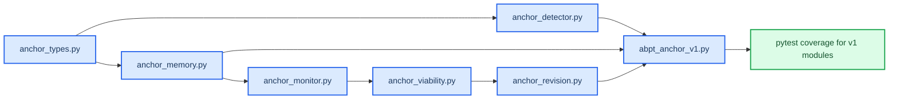

# Subsystem Interfaces — ABPT V1

Date: 2026-03-27
Status: active final pre-code interface memo
Sources:
- `docs/research/ARCHITECTURE_V1.md`
- `docs/research/2026-03-27-v1-implementation-spec.md`

## 🎯 Purpose

This is the last documentation step before code.
It defines the minimal runtime objects and module interfaces needed to start implementing ABPT V1.

## 1. Runtime objects

### 1.1 AnchorState
Required enum values:
- `candidate`
- `provisional`
- `confirmed`
- `decaying`
- `dead_end`

### 1.2 AnchorRecord
Minimal runtime anchor object.

Required fields:
- `id: int`
- `start_idx: int`
- `end_idx: int`
- `repr: Tensor`
- `score: Tensor | float`
- `state: AnchorState`
- `support: Tensor | float`
- `contradiction_pressure: Tensor | float`
- `viability: Tensor | float`
- `ttl: Tensor | float`

Optional v1 fields:
- `parent_id: int | None`
- `branch_id: int | None`
- `descendant_mass: Tensor | float | None`

### 1.3 AnchorCandidate
Detector output before consolidation.

Required fields:
- `start_idx`
- `end_idx`
- `repr`
- `score`
- `semantic_weight`

### 1.4 RevisionDecision
Controller output.

Required fields:
- `anchor_id`
- `action`
- `reason`
- `new_state`
- `alt_branch_used`

Allowed v1 actions:
- `keep`
- `downgrade`
- `revise`
- `retire`

## 2. Module interfaces

### 2.1 AnchorDetector
Responsibility:
- convert hidden-state flow into anchor candidates

Suggested signature:
- `forward(hidden: Tensor, history: Tensor | None, attention_mask: Tensor | None = None) -> dict`

Required outputs:
- `candidates`
- `scores`
- `span_bounds`
- `semantic_weights`

### 2.2 AnchorMemory
Responsibility:
- store and update active anchors over time

Suggested methods:
- `add_candidates(...)`
- `update_support(...)`
- `update_ttl(...)`
- `apply_revision(...)`
- `get_active_anchors(...)`
- `export_diagnostics(...)`

Required outputs:
- active anchor list
- per-anchor state
- memory diagnostics

### 2.3 ContradictionMonitor
Responsibility:
- compute contradiction pressure for each active anchor

Suggested signature:
- `forward(hidden: Tensor, anchors: list, aux: dict | None = None) -> dict`

Required outputs:
- `contradiction_pressure`
- `pressure_components`

### 2.4 ViabilityTracker
Responsibility:
- transform support and contradiction into survival estimates

Suggested signature:
- `forward(anchors: list, contradiction: dict) -> dict`

Required outputs:
- `viability`
- `state_updates`

### 2.5 AnchorArbiter
Responsibility:
- compare current anchor reading with one alternative when needed

Suggested signature:
- `forward(hidden: Tensor, anchor: AnchorRecord, alt: dict | None = None) -> dict`

Required outputs:
- `prefer_current`
- `margin`
- `arbiter_score`

### 2.5a AlternativeHypothesisProposal
Responsibility:
- produce the alternative reading consumed by the arbiter
- keep alternative generation explicit rather than buried inside the arbiter

Suggested signature:
- `propose(hidden: Tensor, input_ids: Tensor | None, anchor: AnchorRecord, aux: dict | None = None) -> dict`

Required v1 outputs:
- `repr`

Desired later outputs:
- `span_bounds`
- `proposal_type`
- `regime_family`
- `confidence`

Build rule:
- do **not** treat "maximally different hidden state" as a sufficient alternative hypothesis
- an alternative is valid only if it can plausibly replace the current reading as the root of future continuation

### 2.6 RevisionController
Responsibility:
- make explicit decisions when viability fails or contradiction spikes

Suggested signature:
- `forward(anchors: list, viability: dict, arbiter: dict | None = None) -> list`

Required outputs:
- list of `RevisionDecision`

## 3. Model-level interface

### 3.1 ABPTAnchorV1 forward contract
The integrated model should still follow project convention:
- `forward()` returns a dict with intermediate values

Required top-level outputs:
- `logits`
- `loss` if labels are present
- `hidden`
- `anchor_candidates`
- `active_anchors`
- `anchor_states`
- `contradiction_pressure`
- `viability`
- `revision_events`
- `anchor_diagnostics`

## 4. Diagnostics contract

V1 is invalid if it hides anchor behavior.
At minimum, diagnostics must expose:
- number of active anchors
- count by anchor state
- mean anchor score
- mean contradiction pressure
- mean viability
- count of revision events
- count of dead-end recognitions

## 5. Data shape expectations

V1 should follow current model conventions:
- token batch hidden states: `[B, T, D]`
- anchor representations: `[B, A, D]` or list-based structure for simplicity
- per-anchor scalar diagnostics: `[B, A]` where tensorized

In early v1, list-based anchor containers are acceptable if they make the logic clearer.

## 6. First code files to create

Recommended first file set:
- `src/model/anchor_types.py`
- `src/model/anchor_detector.py`
- `src/model/anchor_memory.py`
- `src/model/anchor_monitor.py`
- `src/model/anchor_viability.py`
- `src/model/anchor_revision.py`
- `src/model/abpt_anchor_v1.py`
- `tests/test_anchor_detector.py`
- `tests/test_anchor_memory.py`
- `tests/test_anchor_revision.py`
- `tests/test_abpt_anchor_v1.py`

## 7. Build order

## 8. Final build rule

No more theory docs are required before code.
If interfaces change, they should now change because implementation teaches us something concrete, not because the project lacks conceptual structure.

## One-sentence summary

`SUBSYSTEM_INTERFACES.md` defines the exact runtime objects and module contracts needed to begin implementing ABPT V1 without reopening the theory stack each time.
